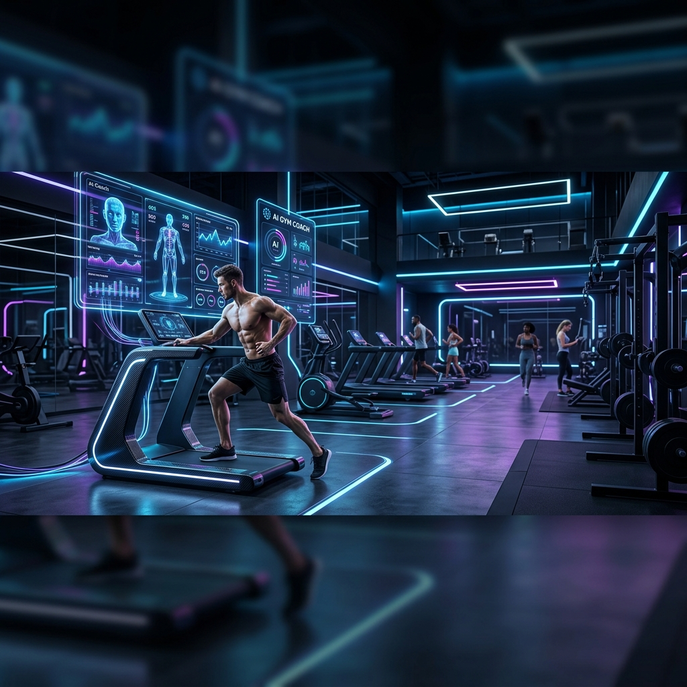

<div align="center">
  
  
  # 🏋️‍♂️ AI Real-Time GYM Coach
  
  **Real-time pose detection with proactive AI voice coaching**

  <p align="center">
    
    
    
    
    
  </p>
</div>

<br>

## ✨ About the Project

**AI Real-Time GYM Coach** is a cutting-edge web application that transforms your device into a personal trainer. Utilizing computer vision (MediaPipe) and advanced Large Language Models (Groq), it tracks your workout in real-time and provides actionable, voice-guided feedback to perfect your form and count your reps.

No more guessing if your squats are deep enough or if your form is correct. Apna AI Coach watches, analyzes, and guides you to success.

---

## 🚀 Key Features

- **📷 Real-Time Pose Detection:** Uses WebRTC and MediaPipe for accurate, low-latency body tracking directly in your browser.
- **🗣️ Proactive AI Voice Coaching:** Integration with Groq LLMs and gTTS provides dynamic, intelligent voice feedback based on your live performance metrics.
- **📊 Granular Exercise Metrics:** Tracks joint angles, depth, stability, and alignment to ensure perfect form.
- **📈 Workout History & Analytics:** Saves your progress, reps, sets, and workout duration, allowing you to track your gains over time.
- **🎨 Modern, Premium UI:** A sleek, dark-mode focused interface designed for clarity and focus during your workouts.

---

## 🤸 Supported Exercises & Tracking Metrics

The application currently supports the following exercises with specific form analysis:

| Exercise | Tracked Metrics |
| --- | --- |
| **Squats** | Knee Angle, Back Angle, Depth Status |
| **Push-ups** | Elbow Angle, Body Alignment, Hip Position |
| **Biceps Curls** | Elbow Angle, Shoulder Stability, Swing Detection |
| **Shoulder Press** | Elbow Angle, Arm Extension, Back Arch |
| **Lunges** | Front Knee Angle, Torso Angle, Balance Status |

---

## 🛠️ Technology Stack

* **Frontend:** Streamlit, HTML/CSS
* **Computer Vision:** OpenCV, MediaPipe
* **AI & Voice:** Groq API (LLM Coaching), gTTS (Text-to-Speech)
* **Real-time Video:** Streamlit-WebRTC
* **Data Handling:** Pandas, SQLite (via Custom Repository)

---

## ⚙️ Installation & Setup

Follow these steps to run the AI Gym Coach on your local machine:

### 1. Clone the repository
```bash
git clone https://github.com/your-username/ai-gym-coach.git
cd ai-gym-coach/"Main App"
```

### 2. Create a virtual environment
```bash
python -m venv venv
source venv/bin/activate  # On Windows use: venv\Scripts\activate
```

### 3. Install dependencies
```bash
pip install -r requirements.txt
```

### 4. Configure Environment Variables
Create a `.env` file in the `Main App` directory and add your Groq API Key:
```env
GROQ_API_KEY=your_groq_api_key_here
```

### 5. Run the Application
```bash
streamlit run main.py
```

---

## 📝 License

Distributed under the MIT License. See `LICENSE` for more information.

<div align="center">
  <br>
  <i>Built with ❤️ for fitness enthusiasts and tech lovers.</i>
</div>